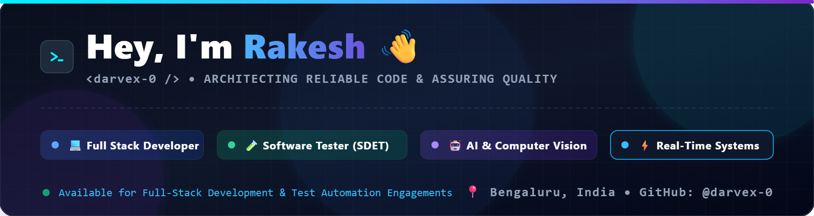

<div align="center">

  <!-- Custom High-DPI Header Banner (Embedded Local Asset - 100% Reliable) -->
  <a href="https://github.com/darvex-0">
    
  </a>

  <br/><br/>

  <!-- Dynamic Typing Subheading -->
  <a href="https://github.com/darvex-0">
    
  </a>

  <br/><br/>

  <!-- Quick Badges Bar -->
  <p align="center">
    <a href="https://github.com/darvex-0"></a>
    <a href="https://github.com/darvex-0?tab=repositories"></a>
    <a href="https://github.com/darvex-0"></a>
    <a href="mailto:rakeshpallamgod@gmail.com"></a>
  </p>

</div>

---

### 👨‍💻 About Me

```yaml
name: Rakesh (darvex-0)
title: Software Developer & Software Tester (SDET / QA)
core_disciplines:
  - Full-Stack Web Development & Microservices
  - Quality Assurance, Test Automation & Verification
  - API, Performance & Security Testing
  - Computer Vision & AI Systems Engineering
philosophy: "Building high-performance code with a relentless focus on quality, resilience, and test-driven reliability."
```

- 🧪 **Software Testing & QA:** Experienced in manual & automated testing lifecycle—including Unit, Integration, End-to-End (E2E), API testing, regression suites, and bug lifecycle tracking.
- 🚀 **Full-Stack Development:** Architecting responsive frontends, scalable REST/FastAPI backend microservices, and real-time WebRTC/WebSocket communication channels.
- 🔍 **Quality Mindset:** Bridging the gap between software development and quality assurance to detect edge cases early, maintain high test coverage, and deliver production-ready software.
- ⚡ **Specialties:** WebAuthn security, local LLM microservices (Ollama), real-time gesture recognition (OpenCV/MediaPipe), and API validation.

---

### 🧪 QA & Testing Methodologies

```mermaid
flowchart LR
    A[Unit & Component Testing] --> B[Integration & API Testing]
    B --> C[E2E & UI Automation]
    C --> D[Performance & Stress Testing]
    D --> E[Security & Regression Validation]
    E --> F[🚀 Robust Production Release]
    
    style A fill:#0f172a,stroke:#00f2fe,stroke-width:2px,color:#fff
    style B fill:#0f172a,stroke:#38bdf8,stroke-width:2px,color:#fff
    style C fill:#0f172a,stroke:#818cf8,stroke-width:2px,color:#fff
    style D fill:#0f172a,stroke:#c084fc,stroke-width:2px,color:#fff
    style E fill:#0f172a,stroke:#f472b6,stroke-width:2px,color:#fff
    style F fill:#0f172a,stroke:#4ade80,stroke-width:2px,color:#fff
```

<div align="center">



</div>

---

### 🏆 GitHub Achievements & Badges

<div align="center">

| **Quickdraw** ⚡ | **Pull Shark** 🦈 | **Pair Extraordinaire** 👯 | **YOLO** 🚀 | **Starstruck** 🌟 | **Arctic Vault** ❄️ |
| :---: | :---: | :---: | :---: | :---: | :---: |
|  |  |  |  |  |  |

<br />

<p>
  
  
  
  
  
</p>

</div>

---

### 🛠️ Skills & Technologies

<div align="center">

#### 🧪 Software Testing & QA Tools


#### 🌐 Languages & Frontend Development


#### ⚙️ Backend, AI & Computer Vision


#### 🗄️ Databases, Cloud & DevOps


</div>

---

### 📂 Featured Repositories & Engineered Projects

<table>
  <tr>
    <td width="50%" valign="top">
      <h3 align="center"><a href="https://github.com/darvex-0/ConnectHub">💬 ConnectHub</a></h3>
      <p align="center">
        
        
        
        
      </p>
      <p>High-performance real-time chat platform with WebRTC audio/video calling, in-chat multiplayer games, and local AI assistant integration. Thoroughly tested for concurrency, connection drops, and real-time state synchronization.</p>
    </td>
    <td width="50%" valign="top">
      <h3 align="center"><a href="https://github.com/darvex-0/ConnectHubBackend">🤖 ConnectHubBackend</a></h3>
      <p align="center">
        
        
        
        
      </p>
      <p>Lightweight FastAPI microservice bridging ConnectHub with local Ollama LLMs. Features complete API contract validation, error boundary handlers, and fast response times.</p>
    </td>
  </tr>
  <tr>
    <td width="50%" valign="top">
      <h3 align="center"><a href="https://github.com/darvex-0/Biometric-Voting-System">🗳️ Biometric-Voting-System</a></h3>
      <p align="center">
        
        
        
        
      </p>
      <p>Secure, paperless voting platform utilizing WebAuthn for mobile fingerprint authentication and End-to-End Encryption (E2EE). Stress-tested for ballot tamper-proofing, cryptographic integrity, and voter anonymity.</p>
    </td>
    <td width="50%" valign="top">
      <h3 align="center"><a href="https://github.com/darvex-0/Hotel-Booking">🏨 Hotel-Booking</a></h3>
      <p align="center">
        
        
        
        
      </p>
      <p>Full-stack hotel reservation platform with an interactive guest portal, admin dashboard, and UPI payment integration. Tested across edge cases in reservation conflicts and transaction verification.</p>
    </td>
  </tr>
  <tr>
    <td width="50%" valign="top">
      <h3 align="center"><a href="https://github.com/darvex-0/SemSensei">🎓 SemSensei</a></h3>
      <p align="center">
        
        
        
      </p>
      <p>Modern educational platform combining Next.js, Firebase, Supabase, Framer Motion, and 3D graphics for an intuitive, crash-resilient learning interface.</p>
    </td>
    <td width="50%" valign="top">
      <h3 align="center"><a href="https://github.com/darvex-0/AniTrace">🎬 AniTrace</a></h3>
      <p align="center">
        
        
        
      </p>
      <p>Anime tracking & discovery application connected to official media APIs. Validated for asynchronous data fetching, responsive layouts, and zero client crashes.</p>
    </td>
  </tr>
  <tr>
    <td width="50%" valign="top">
      <h3 align="center"><a href="https://github.com/darvex-0/gesture-paint">🎨 gesture-paint</a></h3>
      <p align="center">
        
        
        
      </p>
      <p>Contactless air-drawing and painting application. Validated for real-time latency optimization, landmark tracking accuracy, and gesture threshold stability.</p>
    </td>
    <td width="50%" valign="top">
      <h3 align="center"><a href="https://github.com/darvex-0/Whack_a_Mole">🔨 Whack_a_Mole</a></h3>
      <p align="center">
        
        
        
      </p>
      <p>Vision-based arcade game utilizing real-time webcam tracking. Tested for frame-rate consistency, hit detection accuracy, and boundary conditions.</p>
    </td>
  </tr>
  <tr>
    <td width="50%" valign="top">
      <h3 align="center"><a href="https://github.com/darvex-0/TextSleuthAi-Project">🔍 TextSleuthAi-Project</a></h3>
      <p align="center">
        
        
      </p>
      <p>Intelligent text inspection and analysis tool. Validated with automated test cases for edge-case string parsing and token extraction.</p>
    </td>
    <td width="50%" valign="top">
      <h3 align="center"><a href="https://github.com/darvex-0/TypingArc-Project">⌨️ TypingArc-Project</a></h3>
      <p align="center">
        
        
        
      </p>
      <p>Speed typing test web application with instantaneous WPM and accuracy metrics, cross-browser tested for responsive feedback.</p>
    </td>
  </tr>
</table>

---

### 📊 GitHub Analytics & Profile Overview

<div align="center">

  <a href="https://github.com/darvex-0">
    
  </a>

  <br/><br/>

  <table border="0">
    <tr>
      <td>
        <a href="https://github.com/darvex-0">
          
        </a>
      </td>
      <td>
        <a href="https://github.com/darvex-0">
          
        </a>
      </td>
    </tr>
  </table>

</div>

---

### 📈 Activity Graph

<div align="center">
  <a href="https://github.com/darvex-0">
    
  </a>
</div>

---

### 📬 Get in Touch

<div align="center">

  <a href="mailto:rakeshpallamgod@gmail.com">
    
  </a>
  <a href="https://github.com/darvex-0">
    
  </a>

  <br/><br/>
  
  <p>⭐️ <i>Feel free to explore my repositories, open issues, and collaborate!</i></p>

</div>
